# Walton Robotics Programming Course
### Team 2974 · 2026–27 Season

A two-phase FRC programming course built with Jekyll and hosted on GitHub Pages. Covers Java foundations through full FRC robot development.

**Live site: [wrtprogramming.com](https://wrtprogramming.com/)**

---

## Structure

```mermaid
graph TD
    ROOT["wrtprogramming.com"] --> SUMMER["Phase 1: Java Foundations\nweeks/summer/"]
    ROOT --> OFFSEASON["Phase 2: FRC Training\nweeks/offseason/"]
    ROOT --> AUTH["Auth & Dashboards"]
    ROOT --> INFRA["Infrastructure"]

    SUMMER --> S1["W1 · The Basics"]
    SUMMER --> S2["W2 · Logic & Control Flow"]
    SUMMER --> S3["W3 · Loops"]
    SUMMER --> S4["W4 · Arrays & Methods"]
    SUMMER --> S5["W5 · Classes & Objects"]
    SUMMER --> S6["W6 · Inheritance & Polymorphism"]
    SUMMER --> S7["W7 · Advanced Classes"]
    SUMMER --> S8["W8 · Recap & Resources"]

    OFFSEASON --> O1["O1 · Git & GitHub"]
    OFFSEASON --> O2["O2 · WPILib Setup & Project Structure"]
    OFFSEASON --> O3["O3 · Command-Based Architecture"]
    OFFSEASON --> O4["O4 · Motor Controllers & Sensors"]
    OFFSEASON --> O5["O5 · PID Control"]
    OFFSEASON --> O6["O6 · Autonomous & Choreo"]
    OFFSEASON --> O7["O7 · Subsystem Capstone"]
    OFFSEASON --> O8["O8 · Build Season Prep"]

    AUTH --> LOGIN["login.md"]
    AUTH --> DASH["dashboard-teacher.md"]
    AUTH --> FB["Firebase Auth + Firestore\n(accounts & score sync)"]

    INFRA --> JEKYLL["Jekyll + _layouts/ + _includes/"]
    INFRA --> SCSS["_sass/partials/\n(tokens, components, dark mode)"]
    INFRA --> WRC["assets/js/wrc.js\n(quiz engine, progress tracking)"]
    INFRA --> AUTHJS["assets/js/auth.js\n(Firebase auth module)"]
```

---

## Tech Stack

| Layer | Tool |
|-------|------|
| Site generator | Jekyll (Ruby) |
| Styles | SCSS → compiled by Jekyll |
| Auth & data | Firebase Auth + Firestore |
| Quiz engine | Vanilla JS (`wrc.js`) |
| Hosting | GitHub Pages |
| Fonts | JetBrains Mono + DM Sans |

---

## Features

- **Firebase auth** — student accounts with role-based access (student / admin)
- **Score sync** — quiz scores saved to Firestore, visible on teacher dashboard
- **Interactive quizzes** with per-question feedback and explanations
- **Weekly tests** — 8-question tests at the end of each summer week
- **Fill-in-the-blank exercises** for syntax practice
- **Coding challenges** with hidden solutions
- **Progress tracking** — mark pages complete, synced to cloud
- **Dark mode default** — built for programmers
- **Mobile responsive**
- **Teacher dashboard** — view all student scores and answer breakdowns

---

## Deploying to GitHub Pages

1. Push to `main`
2. Go to **Settings → Pages → Source → Deploy from branch → main → / (root)**
3. Site will be live at your custom domain (set via `CNAME`)

Jekyll is built automatically by GitHub Pages on every push.

---

## Contributing

Found a mistake or want to improve an explanation?

1. Branch off main: `git checkout -b fix/week3-typo`
2. Make your changes
3. Open a PR with a short description
4. Tag Sohan for review

---

*"Ask and you shall receive." — Banks*
